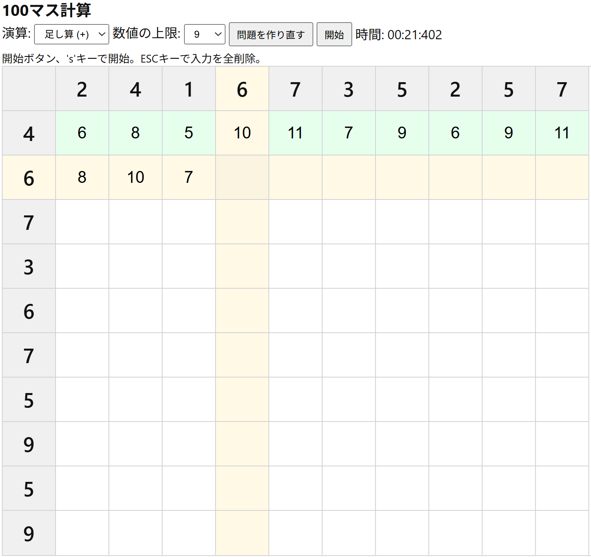

# 100マス計算 Webアプリ

ブラウザで遊べる「100マス計算」アプリです。  
足し算・引き算などの練習を楽しく行うことができます。

## 🎮 使い方

### ▶ Webで遊ぶ

以下のURLにアクセスするだけで、すぐに遊べます。  
👉 [https://kawayan.github.io/100-cell-calculation/](https://kawayan.github.io/100-cell-calculation/)

---

### 💻 ローカルで実行する

1. リポジトリをクローンまたはダウンロードします。
2. npmをダウンロードします。
3. tscコマンドを実行します。
4. index.htmlを開きます。
